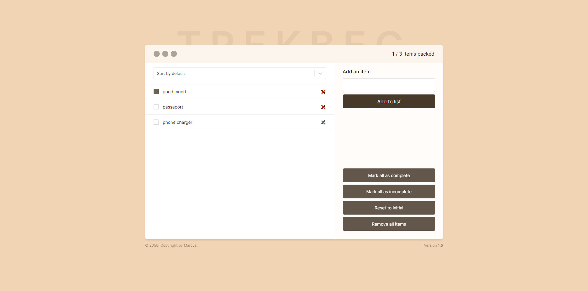

# Trekbag

 <!-- Add the path to your image here -->

## What is the project about?

Trekbag is a React-based application designed to help users manage their trekking equipment efficiently. The app allows users to add items, mark them as packed, delete items from the list, and sort them based on different criteria, ensuring they are well-prepared for their outdoor adventures.

## Why did you develop it, what was your motivation?

The primary motivation behind developing Trekbag was to revisit and strengthen my knowledge of React. I aimed to refresh my understanding of key concepts such as prop drilling, component separation, and making components more reusable. Additionally, I wanted to create a practical tool that could assist trekkers in organizing their gear effectively.

## What problem does it solve?

Trekbag addresses the common issue trekkers face in organizing and managing their equipment. By providing a user-friendly interface, the app allows users to easily add, categorize, and manage their trekking gear, ensuring they have everything they need for their trip. This reduces the chances of forgetting essential items and helps in better preparation.

## Key Features

- **Add Items**: Users can add new items to their packing list.
- **Mark as Packed**: Users can mark items as packed by checking the checkbox.
- **Delete Items**: Users can delete items from the list.
- **Bulk Actions**:
  - **Mark All as Packed**: Marks all items as packed.
  - **Mark All as Unpacked**: Removes the check from all items.
  - **Reset to Initial State**: Resets the list to default values.
  - **Remove All**: Removes all items from the list.
- **Sorting**:
  - **Sort by Packed**: Sorts items by packed status.
  - **Sort by Unpacked**: Sorts items by unpacked status.
  - **Sort by Default**: Sorts items by their default order.

## Data Persistence

Trekbag uses Zustand's "persist" middleware to ensure that the app's state is saved in the local storage. This means that even if you close the app or refresh the page, your data will persist and be available the next time you open the app. This feature enhances the user experience by providing a seamless and consistent way to manage your trekking gear.

## What have you learned?

Through the development of Trekbag, I have revisited and solidified several important concepts in React, including:

- Solving prop drilling issues
- Effective component separation
- Enhancing component reusability
- State management using Zustand, including persistent state with local storage

## What makes your project stand out?

Trekbag stands out due to its simplicity and practical utility. Despite being a simple project, it effectively demonstrates the use of modern React practices and libraries to solve a real-world problem. The integration of `react-select` for better item selection and `zustand` for state management and persistence showcases how to leverage these libraries to build a responsive and efficient application.

## Libraries Used

```json
"dependencies": {
    "react": "^18.2.0",
    "react-dom": "^18.2.0",
    "react-select": "^5.7.5",
    "zustand": "^4.4.4"
}
```
